# Gymnasium-RL-Lab

Educational reinforcement learning portfolio built with [Gymnasium](https://gymnasium.farama.org/).  
Algorithms are grouped by environment and paradigm — from tabular methods to deep RL and evolution.

## Quick start

```bash
python3 -m venv .venv
source .venv/bin/activate
pip install -r requirements/base.txt
pip install -r requirements/box2d.txt      # LunarLander
pip install -r requirements/mujoco.txt       # HalfCheetah + W&B

wandb login   # required for most trainers (all HalfCheetah scripts: SAC, PPO, evolution)
```

Tabular (FrozenLake) and discrete (LunarLander) scripts run without W&B. For HalfCheetah
trainers, create a [Weights & Biases](https://wandb.ai/) account and run `wandb login`
before training — the scripts call `wandb.init` and expect an authenticated session.
Smoke tests disable logging via `WANDB_MODE=disabled` automatically.

Smoke-test all algorithms:

```bash
bash scripts/smoke_test.sh
```

## Project hub

| Method Type | Environment | Algorithms | Folder | Demo | Learning Curves |
|-------|-------------|------------|--------|------|-----------------|
| Tabular | FrozenLake-v1 | Q-learning, SARSA | [`frozen_lake/`](algorithms/tabular/frozen_lake/) |   |   |
| Discrete Control | LunarLander-v3 | PPO mini-batch | [`lunar_lander/`](algorithms/discrete_control/lunar_lander/) | 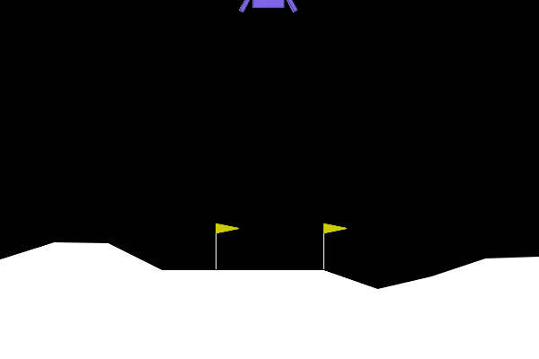 | 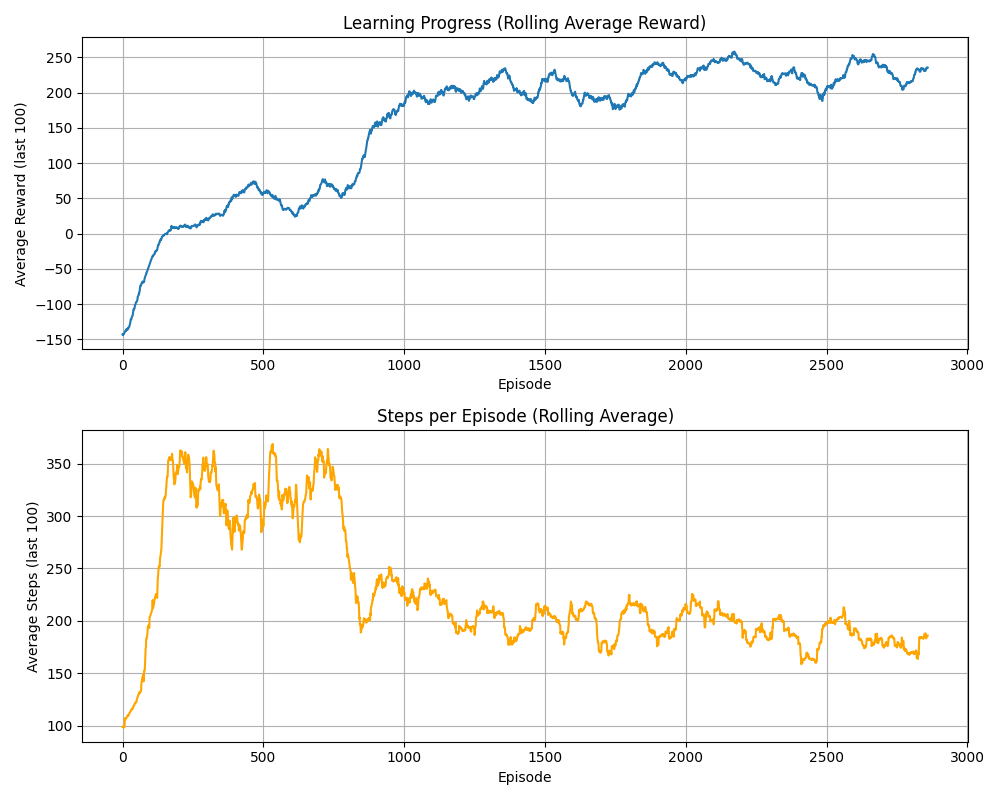 |
| Continuous Control | HalfCheetah-v5 | SAC, PPO | [`sac/`](algorithms/continuous_control/halfcheetah/sac/), [`ppo/`](algorithms/continuous_control/halfcheetah/ppo/) | 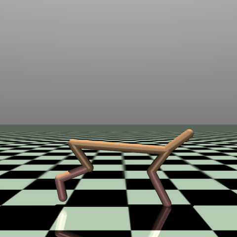 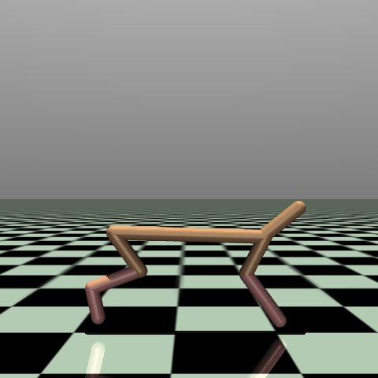 | 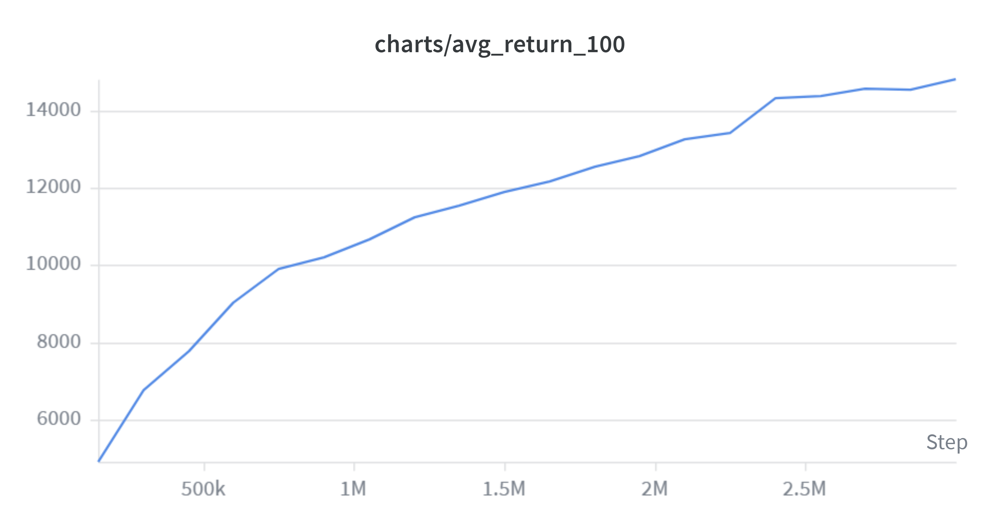 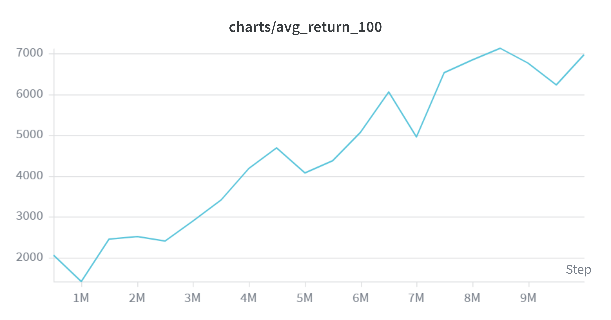 |
| Evolution | HalfCheetah-v5 | CMA-ES, NES, MAP-Elites | [`evolution/`](algorithms/continuous_control/halfcheetah/evolution/) | 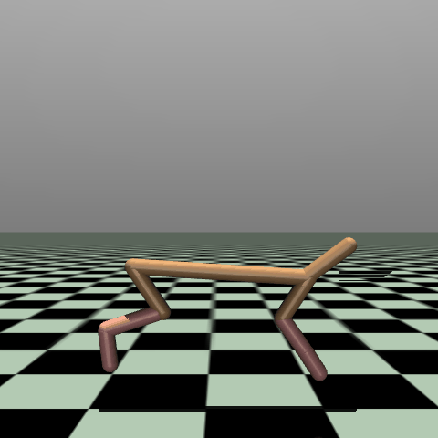 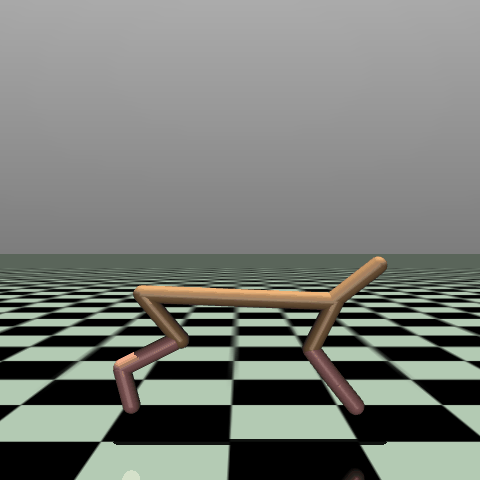 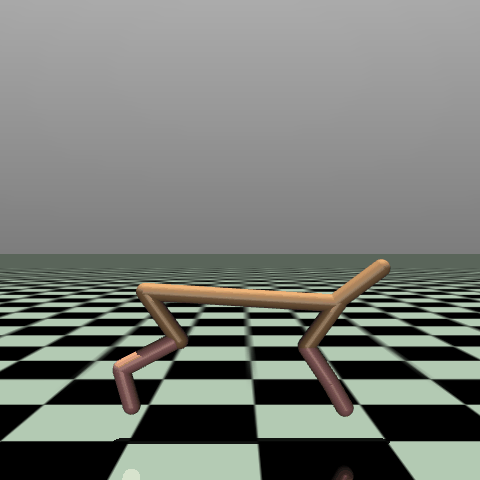 | 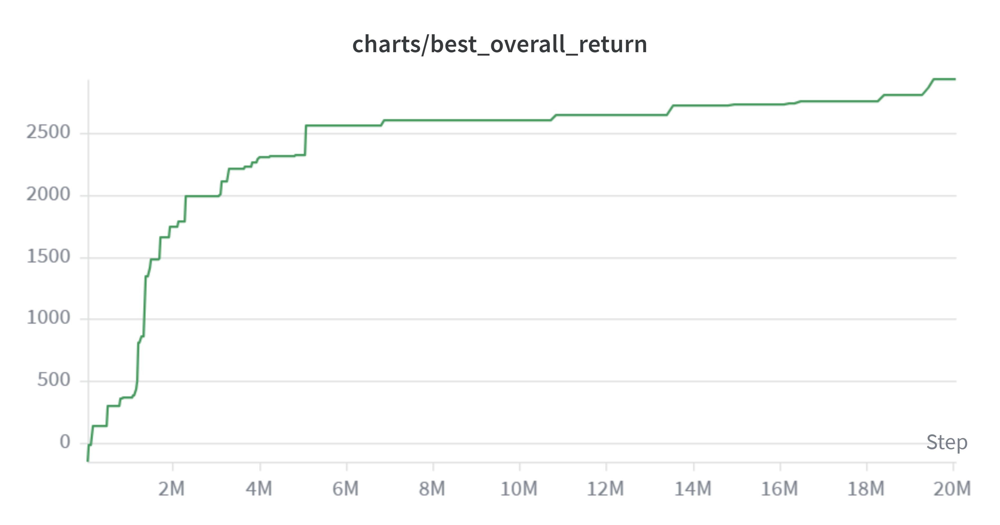 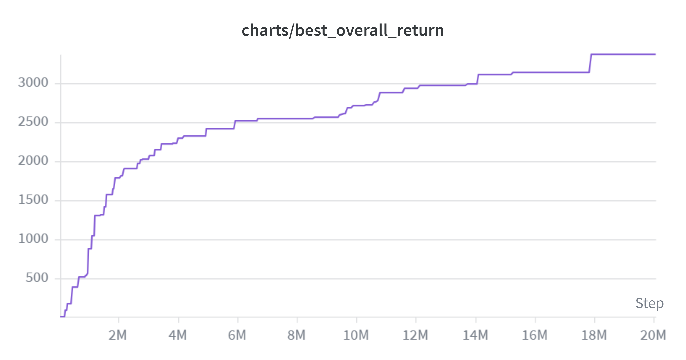 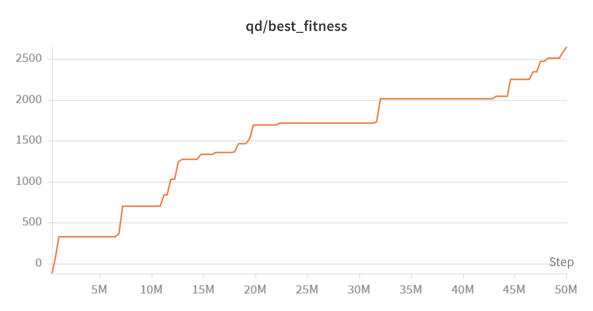 |

On HalfCheetah, [`sac/`](algorithms/continuous_control/halfcheetah/sac/) and [`ppo/`](algorithms/continuous_control/halfcheetah/ppo/) implement the same environment with different continuous-control paradigms; the SAC sources include **`[SAC vs PPO]`** inline comments for a direct comparison — see [`halfcheetah/README.md`](algorithms/continuous_control/halfcheetah/README.md).

## Repository layout

```
gymnasium-rl-lab/
├── algorithms/          # all training scripts (structure unchanged)
├── models/              # trained checkpoints (mirrors algorithms/ layout)
├── requirements/        # base, box2d, mujoco dependency sets
├── results/             # mirrors algorithms/ (learning curves, demo GIFs)
├── utils/               # shared helpers (e.g. GIF recording)
├── scripts/             # smoke_test.sh
└── repo_paths.py        # helpers for results/ and models/ output paths
```

## Weights & Biases

HalfCheetah trainers (SAC, PPO, CMA-ES, NES, MAP-Elites) log to project
**`gymnasium-rl-lab`**. Run names follow `{Algo}_{Env}_v{N}`. A W&B account and
`wandb login` are required for those runs; use `WANDB_MODE=disabled` only when you
explicitly want offline/no-logging execution (e.g. smoke tests).

## Disclaimer

This is a learning portfolio, not a SOTA benchmark suite. Hyperparameters follow common references (CleanRL, SpinningUp, Engstrom et al.) but are not tuned for competition scores.
