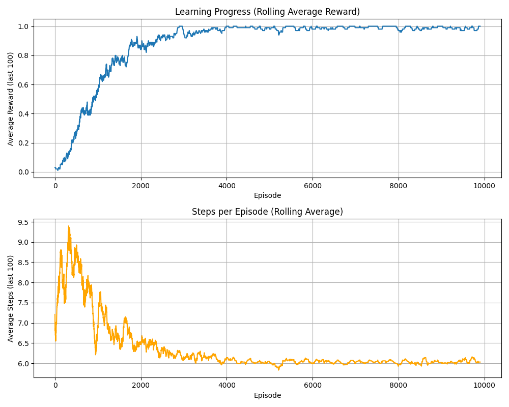
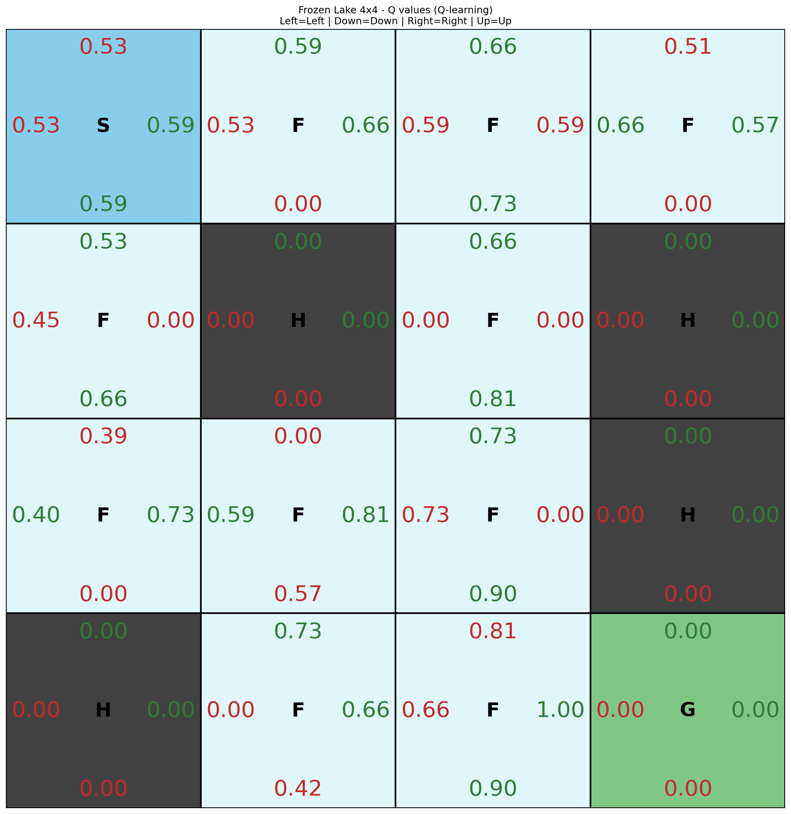
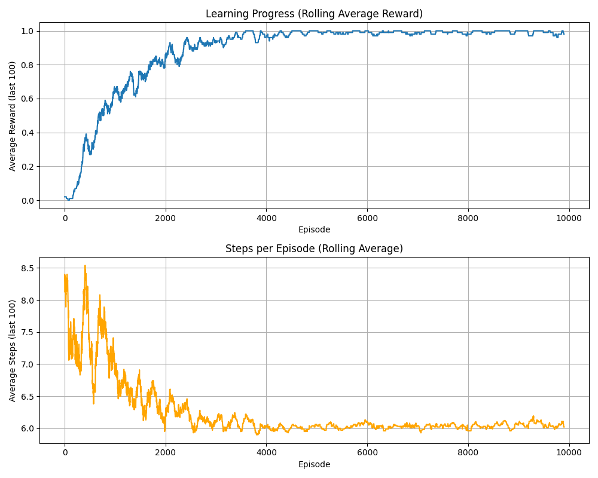
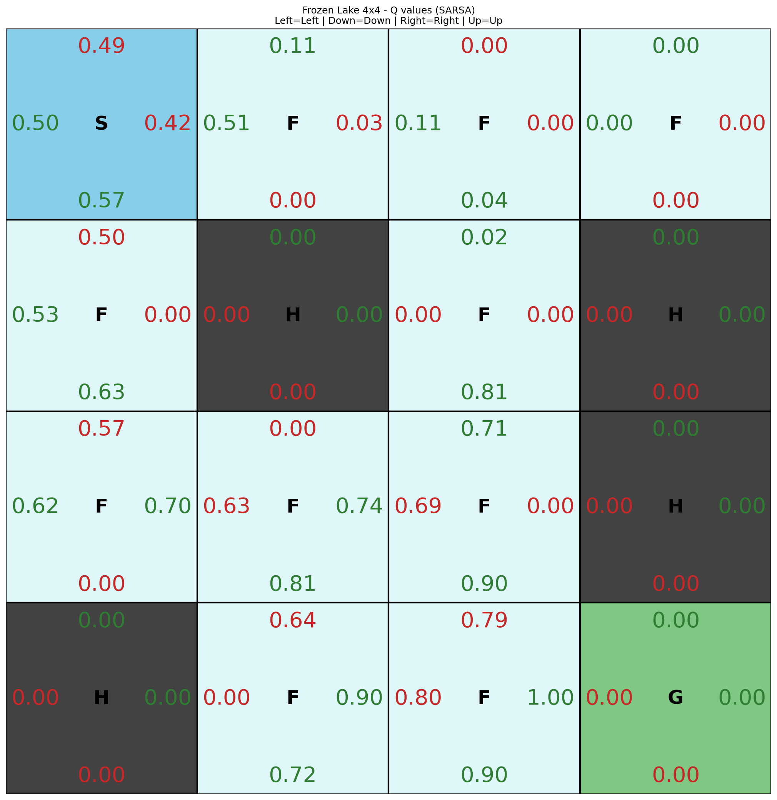

# FrozenLake — Tabular RL

Q-learning (off-policy) and SARSA (on-policy) on `FrozenLake-v1` (4×4, `is_slippery=False`).

## Run

```bash
cd algorithms/tabular/frozen_lake
python Q-learning.py
python SARSA.py
python test_q_learning.py
python test_sarsa.py
```

Both scripts train for **10 000 episodes** with: `epsilon=1.0`, `epsilon_decay=0.999`, `learning_rate=0.1`, `discount_factor=0.9`.

Run training first, then test scripts load the saved Q-table and render episodes (`render_mode='human'`).

## Results

On this deterministic 4×4 map (`is_slippery=False`), both methods converge to a reliable greedy policy. Eval return is binary (0 or 1), so **1.00 ± 0.00 does not mean the algorithms are equivalent** — compare the learning curves and Q-grid plots instead.

| Metric | Q-learning | SARSA |
|---|---:|---:|
| Environment | FrozenLake-v1 (4×4, not slippery) | same |
| Representation | tabular Q-table (16 states × 4 actions) | same |
| Training episodes | 10,000 | 10,000 |
| Seeds | 1 | 1 |
| Eval episodes (ε = 0, greedy) | 10 | 10 |
| Mean eval return | 1.00 ± 0.00 | 1.00 ± 0.00 |

Shared training hyperparameters: `ε=1.0`, `ε_decay=0.999`, `lr=0.1`, `γ=0.9`.

The point of this pair is pedagogical: **Q-learning** learns the optimal Q-values (max over next actions), while **SARSA** updates along the action actually taken — on a hazard-free map they agree; on slippery or larger maps they can diverge.

#### Q-learning

**Demo**


**Learning curve**



**Q-grid**



#### SARSA

**Demo**


**Learning curve**



**Q-grid**



## Outputs

Learning curves and Q-grid plots saved to [`results/tabular/frozen_lake/`](../../../results/tabular/frozen_lake/):

| File | Script |
|------|--------|
| `learning_curve_Q-learning.png` | Q-learning.py |
| `learning_curve_SARSA.png` | SARSA.py |
| `Q_grid_Q_learning.png` | Q-learning.py |
| `Q_grid_SARSA.png` | SARSA.py |
| `q_learning.gif` | test_q_learning.py (`record_video=True`) |
| `sarsa.gif` | test_sarsa.py (`record_video=True`) |

Q-table checkpoints saved to [`models/tabular/frozen_lake/`](../../../models/tabular/frozen_lake/):

| File | Script |
|------|--------|
| `q_values_Q-learning.pkl` | Q-learning.py |
| `q_values_SARSA.pkl` | SARSA.py |

## Key idea

- **Q-learning** updates with `max_a Q(s', a)` — learns the optimal policy while exploring with ε-greedy.
- **SARSA** updates with `Q(s', a')` where `a'` is the action actually taken — on-policy, more conservative near hazards.
